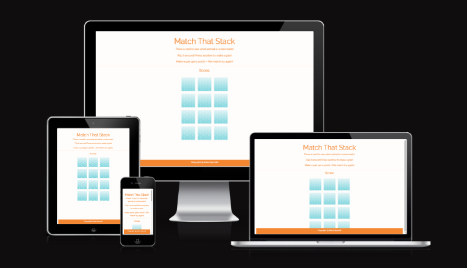
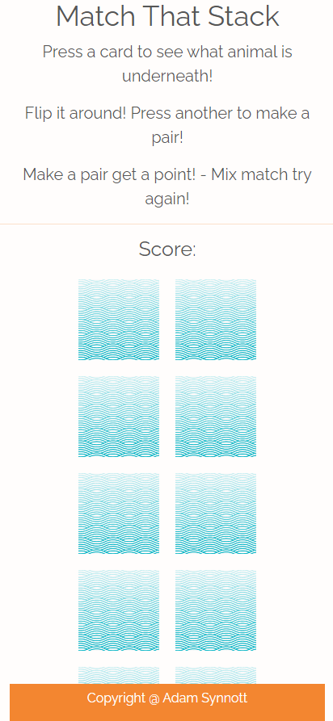
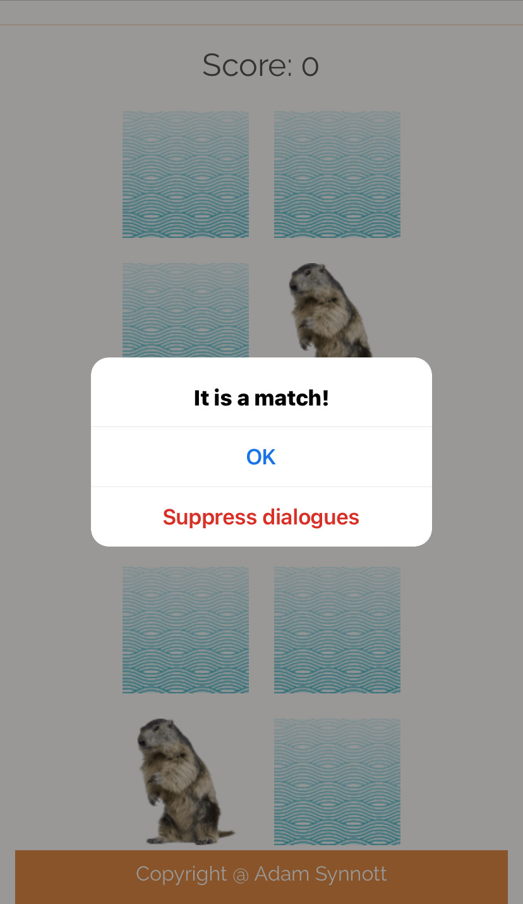
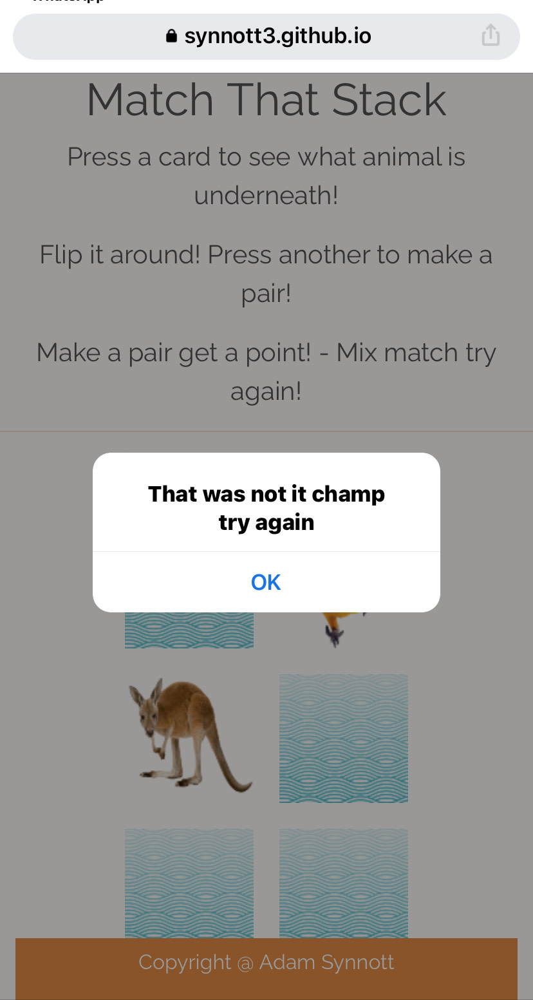
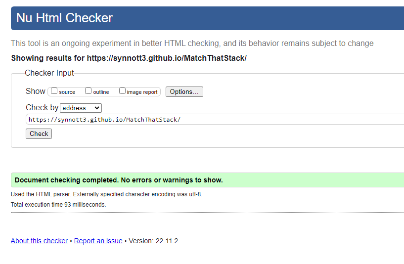

#  Match That Stack! A game about matching pairs! 

Match that stack is a game that is based around the idea of matching pairs in this case animals, I wanted to make a game that had mainly JavaScript elements to it, but something that wasn't heavily loaded in JS. Something that could be build upon easily in the future.

This game is pretty simple, you click or press depending if you're on a computer or a mobile, and the card will flip around and relieve which animal it was behind it - The animal will remain until you click on anther card, get the right animal you get a point, get the wrong animal and the card will flip around again.

The scroed is based on if you get a matching pair or not! 

I designned this game to be simple as it was made for my nephews - but it has room to be made into more for any people. The way the code is done, just a simple swap out of images, or even adding more and more to incase the challenge and difficulty.

[Responsivity](https://ui.dev/amiresponsive?url=https://synnott3.github.io/MatchThatStack/)

### Exisiting Features

#### The Simple Strong Header 

I did have a logo at the top of this page but it came into conflic of the fact I was using the SCR tag to cause my images to flip so had to be removed, but it helped bring the website back down to its base idea - which was to make an website that would have a fun game that could be easily updated and chagned for my  Nephews. 

### Easy to undertand messages and pop ups

As you can see this game is designed to be pick up and play have some fun make a mistake - work on your memory and don't be discouraged if you get something wrong. 

#### The Game Area

The game area is set up in a grid system of 12 cards, 6 of which are the same, and any amount can be addede into the future at any time within the code just be doulbing the grid amount - this was done so that it could be easily edited for whoever is uing it own personal intersets. 

#### The interactive part of the game itself

The game works by pressing the squares and they flip over to relieve an animal underneath - and they allows you to pick a second one and if they match they both disapear and you get a point, if they don't they both flip back over. This is where the memory part comes into play, as they are only random position once loading, but stay in place till the end of the game. So even if you're wrong, you are one step closing to finishing the game.

## Testing 

- The website and functionalilty of the game was tested on Chrome, Firefox, Microsfot Edge and many mobile phones - ranging from Iphones to Andriods.

- Test that each of the squares can be activated and do react on  every device and broswer - as well making sure all message windows pop up and you can complete the game and the hey you won message pops up. 

- Test that every image does dispear when matched.

- Test that every image flips back over when incorrect.

## Bugs 

- The only bug found while working on this project is using  SRC in the setAttribute on elements in my JavaScript   caused my logo to be replaced by a card at random times - hence why i had to remove the logo from top of the page. 

- Bug found while building, looping problems when not setting the correct amount in the Arrays, 

- Fitting correctly once I started to add HTML and CSS as I build  out the JavsScript first.

- All buys now fixed.

## Validator Testing

### Lighthouse - Passed

### HTML - Passed 

### CSS - Passed

