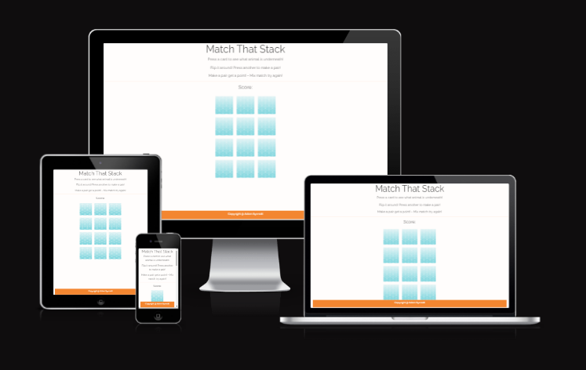

#  Match That Stack! A game about matching pairs! 

Match that stack is a game that is based around the idea of matching pairs in this case animals, I wanted to make a game that had mainly JavaScript elements to it, but something that wasn't heavily loaded in JS. Something that could be build upon easily in the future.

This game is pretty simple, you click or press depending if you're on a computer or a mobile, and the card will flip around and relieve which animal it was behind it - The animal will remain until you click on anther card, get the right animal you get a point, get the wrong animal and the card will flip around again.

The scroed is based on if you get a matching pair or not! 

I designned this game to be simple as it was made for my nephews - but it has room to be made into more for any people. The way the code is done, just a simple swap out of images, or even adding more and more to incase the challenge and difficulty.

[Responsivity](https://ui.dev/amiresponsive?url=https://synnott3.github.io/MatchThatStack/)

### Exisiting Features

#### The Simple Strong Header 

I did have a logo at the top of this page but it came into conflic of the fact I was using the SCR tag to cause my images to flip so had to be removed, but it helped bring the website back down to its base idea - which was to make an website that would have a fun game that could be easily updated and chagned for my  Nephews. 

